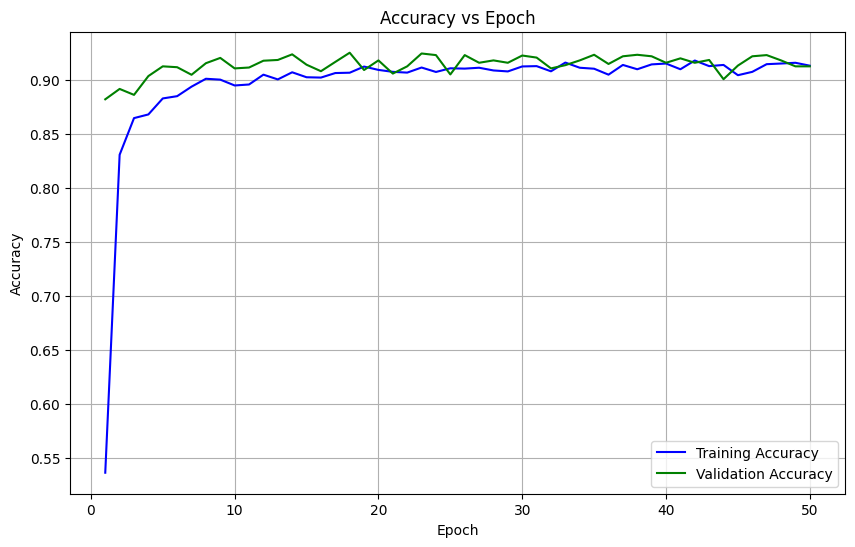
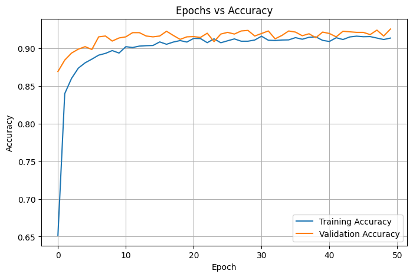
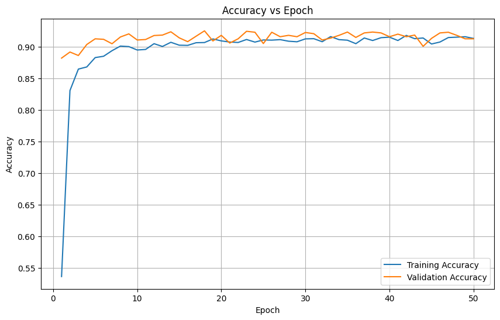
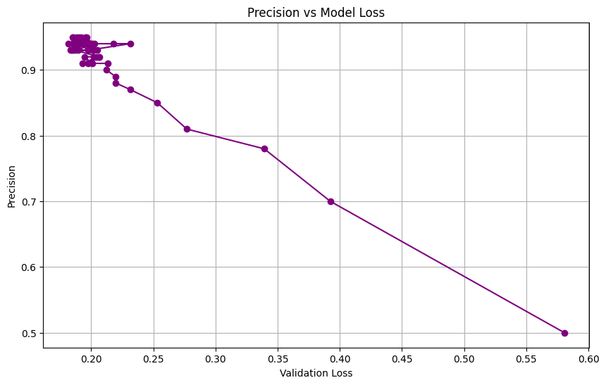

<<<<<<< HEAD
# Hybrid Speaker Identification and Verification System

A deep learning-based speaker recognition framework capable of performing both:

- **Speaker Identification** (Who is speaking?)
- **Speaker Verification** (Are these two voices from the same speaker?)

The system combines **MFCC-based acoustic feature extraction**, **ECAPA-TDNN speaker embeddings**, and a **Deep Neural Network (DNN)** classifier to achieve robust speaker recognition performance across multilingual and real-world speech conditions.

---

# Project Overview

This project was developed as part of a research work on **DNN Embedding-based Speaker Identification Systems** using an in-house multilingual Indian speech corpus.

The framework was designed to:
- Extract speaker-specific vocal characteristics
- Learn discriminative speaker embeddings
- Perform speaker classification using deep neural networks
- Verify speaker similarity using embedding-based cosine similarity scoring

The system supports:
- Hindi
- English
- Telugu
- Multilingual speaker combinations

and was evaluated on a dataset consisting of **51 speakers** collected from diverse linguistic and demographic backgrounds.

---
# End-to-End System Development

One of the most significant aspects of this project is that the entire pipeline was developed completely from scratch, including:

- Dataset collection
- Speech recording
- Data preprocessing
- Feature engineering
- Model training
- Performance evaluation
- Deployment

The project was not built using a pre-existing benchmark dataset alone. Instead, a custom multilingual speaker corpus was created manually for this research work.

---

# Custom Dataset Collection

The speech dataset was personally collected and curated during the project development process.

The dataset creation involved:
- recording voice samples from friends and volunteers
- collecting multilingual utterances
- ensuring speaker diversity
- organizing speaker-wise datasets
- manually verifying recordings

Each speaker contributed approximately:
- 20 spoken sentences
- across 1–3 languages depending on multilingual fluency

Languages included:
- English
- Hindi
- Telugu

The recordings were intentionally collected under varying:
- accents
- speaking styles
- intonations
- linguistic combinations

to improve real-world robustness of the system.

---

# Dataset Engineering Process

The dataset preparation pipeline included:

## Audio Recording
Voice samples were collected using:
- smartphone microphones
- laptop microphones
- online speech sources

---

## Audio Standardization

All recordings were:
- converted to mono
- resampled to 16 kHz
- normalized
- cleaned for noise artifacts

---

## Dataset Organization

The recordings were manually organized speaker-wise into structured directories for supervised learning.

Example:

```text
spk-01/
spk-02/
spk-03/
```

This enabled:
- label encoding
- speaker classification
- embedding learning

---

# End-to-End ML Pipeline Ownership

This project involved complete ownership of the entire machine learning workflow, including:

| Stage | Contribution |
|---|---|
| Dataset Collection | Self-collected multilingual speech corpus |
| Data Cleaning | Audio preprocessing and normalization |
| Feature Engineering | MFCC + ECAPA embeddings |
| Model Design | DNN architecture development |
| Training | TensorFlow/Keras model training |
| Evaluation | Accuracy, loss, EER analysis |
| Verification | Cosine similarity speaker verification |
| Deployment | Streamlit-based web application |
| Debugging | Real-world dataset contamination mitigation |

---

# Practical Engineering Challenges Solved

Several real-world engineering challenges were encountered and addressed during development:

- multilingual speaker variability
- noisy recordings
- speaker imbalance
- preprocessing inconsistencies
- embedding dimensionality alignment
- deployment compatibility
- dataset label contamination during recursive parsing

These challenges provided valuable experience in:
- ML system debugging
- audio AI engineering
- deployment-oriented model design
- practical deep learning workflows

---

# Research and Engineering Focus

This project was developed not only as a deep learning model, but as a complete research-oriented and deployment-ready speaker AI system.

The work combines concepts from:
- Digital Signal Processing (DSP)
- Speech Processing
- Deep Learning
- Speaker Biometrics
- Representation Learning
- AI Deployment Engineering

This end-to-end development approach significantly strengthened understanding of:
- real-world dataset engineering
- speaker embedding systems
- neural network optimization
- inference pipeline design
- production-oriented AI deployment

---


# Key Features

## Speaker Identification
Classifies an uploaded voice sample into one of the known trained speaker classes using:
- MFCC features
- ECAPA embeddings
- DNN classifier

## Speaker Verification
Verifies whether two uploaded voice samples belong to the same speaker using:
- ECAPA-TDNN embeddings
- Cosine similarity scoring

## Audio Preprocessing
Includes:
- Noise reduction
- Silence trimming
- Audio normalization
- 16 kHz mono conversion

## Deep Learning Pipeline
Implements:
- MFCC + Δ + ΔΔ feature extraction
- Speaker embedding generation
- DNN classification
- Similarity-based verification

## Streamlit Deployment
Interactive web-based interface allowing:
- Audio upload
- Real-time prediction
- Similarity scoring
- Confidence visualization

---

# System Architecture

## Speaker Identification Pipeline

```text
Audio Input
    ↓
Preprocessing
    ↓
MFCC Feature Extraction
    ↓
ECAPA-TDNN Embeddings
    ↓
Feature Concatenation
    ↓
DNN Classifier
    ↓
Predicted Speaker
```

---

## Speaker Verification Pipeline

```text
Audio Sample 1
        ↓
ECAPA Embedding

Audio Sample 2
        ↓
ECAPA Embedding
        ↓
Cosine Similarity
        ↓
Same / Different Speaker
```

---

# Dataset Description

The project uses an in-house multilingual speech corpus consisting of:

| Parameter | Details |
|---|---|
| Total Speakers | 51 |
| Languages | English, Hindi, Telugu |
| Gender | Male and Female |
| Age Group | 17–60 years |
| Sampling Rate | 16 kHz Mono |
| Utterances | 20 per speaker per language |
| Audio Duration | 15–20 seconds |

The dataset contains:
- direct microphone recordings
- extracted YouTube speech samples
- multilingual and accent-diverse utterances

This diversity improves robustness and generalization capability under real-world conditions. :contentReference[oaicite:1]{index=1}

---

# Technologies Used

| Technology | Purpose |
|---|---|
| Python | Core implementation |
| TensorFlow / Keras | DNN modeling |
| PyTorch | ECAPA embedding extraction |
| SpeechBrain | Pretrained ECAPA-TDNN model |
| Librosa | Audio processing + MFCC extraction |
| NumPy | Numerical operations |
| scikit-learn | Label encoding + metrics |
| Matplotlib | Training visualization |
| Streamlit | Web deployment |
| Google Colab | Initial model training |

---

# Feature Extraction

## MFCC Features

The system extracts:
- 20 MFCC coefficients
- Delta features (Δ)
- Delta-Delta features (ΔΔ)

MFCCs are widely used in speech processing because they:
- approximate human auditory perception
- capture spectral characteristics
- provide robustness under noisy conditions

The addition of Δ and ΔΔ features helps model temporal speech dynamics.

---

# ECAPA-TDNN Speaker Embeddings

The system integrates pretrained **ECAPA-TDNN embeddings** using the SpeechBrain framework.

These embeddings:
- encode speaker-specific vocal characteristics
- generalize well to unseen speakers
- improve verification robustness

ECAPA embeddings are used for:
- feature augmentation in DNN classification
- cosine similarity-based speaker verification

---

# Deep Neural Network Architecture

The DNN classifier consists of:

- Dense Layer (256 neurons)
- Dropout (0.3)
- Dense Layer (128 neurons)
- Dropout (0.3)
- Softmax Output Layer

Activation Functions:
- ReLU
- Softmax

Optimizer:
- Adam Optimizer

Loss Function:
- Categorical Crossentropy

---

# Training Details

The model was trained using:
- 50 epochs
- Batch size = 16
- 80/20 train-test split

Training was conducted on Google Colab using GPU acceleration.

---

# Performance Metrics

The system was evaluated using:
- Accuracy
- Loss
- Equal Error Rate (EER)
- Cosine Similarity Scores

---

# Experimental Results

| Epochs | Accuracy | EER |
|---|---|---|
| 10 | 90.25% | 9.5% |
| 20 | 91.34% | 8.2% |
| 30 | 91.73% | 7.5% |
| 40 | 91.52% | 6.8% |
| 50 | 91.26% | 6.2% |

The model demonstrated:
- stable convergence
- strong generalization
- low overfitting
- reliable speaker discrimination performance

# Training Visualization and Performance Analysis

The following plots illustrate the convergence behavior, training stability, and generalization capability of the proposed DNN-based speaker identification system.

---

## Accuracy vs Epoch

The graph below shows the variation of training and validation accuracy across 50 epochs.

- Training accuracy steadily improves during the early epochs.
- Validation accuracy consistently remains close to or slightly higher than training accuracy.
- The convergence of both curves near 91–92% indicates stable learning and strong generalization without significant overfitting.



---

## Epochs vs Accuracy

This visualization highlights the progressive increase in classification accuracy with increasing epochs.

The model demonstrates:
- rapid convergence during initial epochs
- stable performance after convergence
- balanced learning behavior



---

## Model Loss vs Epoch

The loss curves show a rapid reduction in both training and validation loss during early training stages, followed by gradual stabilization.

Observations:
- validation loss remains consistently low
- smooth convergence behavior
- no major oscillations or divergence
- effective optimization using Adam optimizer



---

## Precision vs Model Loss

This graph illustrates the relationship between validation loss and precision.

As validation loss decreases:
- precision improves significantly
- the model becomes increasingly discriminative
- speaker-specific embedding quality improves

The clustering of points near high precision and low loss demonstrates the robustness of the proposed framework.



---

# Model Behavior Analysis

The experimental results indicate:

- Strong convergence behavior
- Stable optimization dynamics
- Effective feature learning
- Minimal overfitting
- Robust generalization capability

The close alignment between training and validation curves confirms that the model learns discriminative speaker representations while maintaining reliable performance on unseen data.

The final system achieved:
- ~91% speaker identification accuracy
- Reduced Equal Error Rate (EER)
- Reliable multilingual speaker discrimination
- Strong verification similarity performance

These results validate the effectiveness of combining:
- MFCC-based acoustic features
- ECAPA-TDNN embeddings
- Deep neural network classification
- Cosine similarity verification

:contentReference[oaicite:2]{index=2}

---

# Verification Performance

The speaker verification module uses cosine similarity scoring.

Typical similarity interpretation:

| Similarity Score | Interpretation |
|---|---|
| 0.85 – 1.00 | Very High Match |
| 0.75 – 0.85 | Moderate Match |
| 0.65 – 0.75 | Weak Match |
| < 0.65 | Different Speakers |

This verification system generalizes well even to previously unseen speakers.

---

# Real-World Applications

This framework can be applied in:

- Voice biometric authentication
- Secure banking systems
- Smart home voice interfaces
- Call center speaker verification
- Forensic speaker analysis
- IoT voice-enabled systems
- Personalized virtual assistants

:contentReference[oaicite:3]{index=3}

---

# Challenges Addressed

The system was designed to handle:
- multilingual speech
- varying accents
- noisy recordings
- channel variability
- speaker diversity

During deployment, a dataset-label contamination issue was identified due to recursive utility-folder parsing. Instead of retraining the entire system, an inference-time filtering mechanism was engineered to ignore invalid utility classes during prediction while preserving the original trained model.

This reflects a practical real-world ML engineering mitigation strategy.

---

# Streamlit Deployment

The project includes an interactive Streamlit application with:

## Speaker Identification Tab
- Upload voice sample
- Predict speaker identity
- Confidence visualization

## Speaker Verification Tab
- Upload two voice samples
- Compute similarity score
- Same/Different speaker decision

---

# Project Structure

```text
speaker-identification-dnn/
│
├── app.py
├── train.py
├── predict.py
├── requirements.txt
├── README.md
│
├── models/
│   ├── speaker_dnn_mfcc_xfactor.h5
│   └── label_encoder_mfcc_xfactor.npy
│
├── utils/
│   ├── audio_processing.py
│   ├── feature_extraction.py
│   └── model_utils.py
│
└── assets/
```

---

# Running the Project

## Install Dependencies

```bash
pip install -r requirements.txt
```

---

## Run Streamlit App

```bash
streamlit run app.py
```

---

# Future Improvements

Future work may include:
- Transformer-based speaker models
- Anti-spoofing mechanisms
- Real-time microphone inference
- Edge AI deployment
- FPGA acceleration
- Domain adaptation
- Noise-robust embeddings
- Mobile deployment

---

# Research Publication

This project is based on the research paper:

**"Performance Evaluation of DNN Embedding-based Speaker Identification System"**

The work evaluates:
- DNN embedding architectures
- multilingual speaker corpora
- MFCC feature extraction
- PLDA-based scoring
- convergence behavior across epochs

:contentReference[oaicite:4]{index=4}

---

# Authors

- Pranav Madanu
- Bittu Kumar
- Rohan Madanu
- MD Sameer Ahmed
- Rizwan
- A B Nitin

---

# License

This project is intended for educational and research purposes.
=======
# Deep-Neural-Network-Based-Speaker-Identification-Systems
Deep learning-based speaker identification system using x-vector (TDNN) embeddings and Probabilistic Linear Discriminant Analysis (PLDA). Includes MFCC feature extraction, custom dataset preprocessing, and evaluation based on accuracy and EER.
 here is the code that i executed for the model:

!pip install -q speechbrain torchaudio librosa tqdm noisereduce pydub tensorflow scikit-learn matplotlib

import os
import numpy as np
import torch
import librosa
import noisereduce as nr
from tqdm import tqdm
from pydub import AudioSegment
from speechbrain.pretrained import EncoderClassifier
from sklearn.preprocessing import LabelEncoder
from sklearn.model_selection import train_test_split
from tensorflow.keras.models import Sequential
from tensorflow.keras.layers import Dense, Dropout
from tensorflow.keras.utils import to_categorical
from tensorflow.keras.optimizers import Adam
import matplotlib.pyplot as plt

from google.colab import drive
drive.mount('/content/drive', force_remount=False)

base_dir = "/content/drive/MyDrive/voice_data"
converted_dir = os.path.join(base_dir, "converted_wav")
os.makedirs(converted_dir, exist_ok=True)


def convert_to_wav(file_path, out_dir):
    try:
        file_name = os.path.basename(file_path)
        new_path = os.path.join(out_dir, os.path.splitext(file_name)[0] + ".wav")
        if os.path.exists(new_path):
            return new_path
        audio = AudioSegment.from_file(file_path)
        audio = audio.set_frame_rate(16000).set_channels(1)
        audio.export(new_path, format="wav")
        return new_path
    except Exception as e:
        print(f"❌ Conversion failed for {file_path}: {e}")
        return None

def preprocess_audio(file_path):
    try:
        y, sr = librosa.load(file_path, sr=16000, mono=True)
        y_denoised = nr.reduce_noise(y=y, sr=sr)
        y_trimmed, _ = librosa.effects.trim(y_denoised, top_db=25)
        y_norm = librosa.util.normalize(y_trimmed)
        return y_norm, sr
    except Exception as e:
        print(f"⚠️ Skipping {file_path}: {e}")
        return None, None

def extract_mfcc_features(y, sr, n_mfcc=20):
    mfcc = librosa.feature.mfcc(y=y, sr=sr, n_mfcc=n_mfcc, hop_length=int(0.010*sr), n_fft=int(0.025*sr))
    mfcc = mfcc.T
    delta = librosa.feature.delta(mfcc)
    delta2 = librosa.feature.delta(mfcc, order=2)
    features = np.concatenate([mfcc, delta, delta2], axis=1)
    mean = np.mean(features, axis=0)
    std = np.std(features, axis=0)
    pooled = np.concatenate([mean, std])
    return pooled

def extract_features(base_dir, use_xfactor=False):
    print(f"📂 Scanning {base_dir} recursively for audio files...\n")
    if use_xfactor:
        classifier = EncoderClassifier.from_hparams(source="speechbrain/spkrec-ecapa-voxceleb")
    features, labels = [], []
    valid_exts = ('.wav', '.m4a', '.mp3', '.flac')
    all_files = []

    for root, _, files in os.walk(base_dir):
        for f in files:
            if f.lower().endswith(valid_exts):
                all_files.append(os.path.join(root, f))

    print(f"🎧 Found {len(all_files)} audio files in total.\n")

    for file_path in tqdm(all_files, desc="🎵 Processing audio"):
        if not file_path.lower().endswith('.wav'):
            file_path = convert_to_wav(file_path, converted_dir)
            if file_path is None:
                continue

        y, sr = preprocess_audio(file_path)
        if y is None:
            continue

        mfcc_feat = extract_mfcc_features(y, sr)

        if use_xfactor:
            try:
                audio_tensor = torch.tensor(y).unsqueeze(0)
                emb = classifier.encode_batch(audio_tensor).squeeze().detach().numpy()
                combined_feat = np.concatenate([mfcc_feat, emb])
            except Exception as e:
                print(f"❌ Error extracting ECAPA embeddings {file_path}: {e}")
                continue
        else:
            combined_feat = mfcc_feat

        label = os.path.basename(os.path.dirname(os.path.dirname(file_path)))
        parent_dir = os.path.basename(os.path.dirname(file_path))
        speaker_label = label if label.startswith("spk-") else parent_dir

        features.append(combined_feat)
        labels.append(speaker_label)

    features = np.array(features)
    labels = np.array(labels)

    if len(features) == 0:
        print("❌ No valid features found.")
    else:
        print(f"✅ Extracted {len(features)} feature vectors of shape {features.shape}")

    return features, labels

def train_dnn(X, y, epochs=50, batch_size=16):  # epochs increased from 20 → 50
    le = LabelEncoder()
    y_enc = le.fit_transform(y)
    y_cat = to_categorical(y_enc)

    X_train, X_test, y_train, y_test = train_test_split(X, y_cat, test_size=0.2, random_state=42)

    model = Sequential([
        Dense(256, activation='relu', input_shape=(X.shape[1],)),
        Dropout(0.3),
        Dense(128, activation='relu'),
        Dropout(0.3),
        Dense(y_cat.shape[1], activation='softmax')
    ])

    model.compile(optimizer=Adam(learning_rate=0.001), loss='categorical_crossentropy', metrics=['accuracy'])

    # ⏳ Save history for plotting
    history = model.fit(X_train, y_train, validation_data=(X_test, y_test),
                        epochs=epochs, batch_size=batch_size, verbose=1)

    # ✅ Evaluate model
    loss, acc = model.evaluate(X_test, y_test, verbose=0)
    print(f"\n✅ Test Accuracy: {acc*100:.2f}%")

    # 📊 Plot Epochs vs Accuracy
    plt.figure(figsize=(8,5))
    plt.plot(history.history['accuracy'], label='Training Accuracy')
    plt.plot(history.history['val_accuracy'], label='Validation Accuracy')
    plt.title('Epochs vs Accuracy')
    plt.xlabel('Epoch')
    plt.ylabel('Accuracy')
    plt.legend()
    plt.grid(True)
    plt.show()

    return model, le

X, y = extract_features(base_dir, use_xfactor=True)

if len(X) == 0:
    print("❌ No features extracted. Check folder structure or audio formats.")
else:
    print(f"✅ Final dataset: {len(X)} samples, feature dim = {X.shape[1]}")
    model, label_encoder = train_dnn(X, y, epochs=50, batch_size=16)

    model.save(os.path.join(base_dir, "speaker_dnn_mfcc_xfactor.h5"))
    np.save(os.path.join(base_dir, "label_encoder_mfcc_xfactor.npy"), label_encoder.classes_)
    print("✅ Model and label encoder saved successfully.")

>>>>>>> ff08fc0f22a4e3ee11961e1d5959ce6dddf159e5
